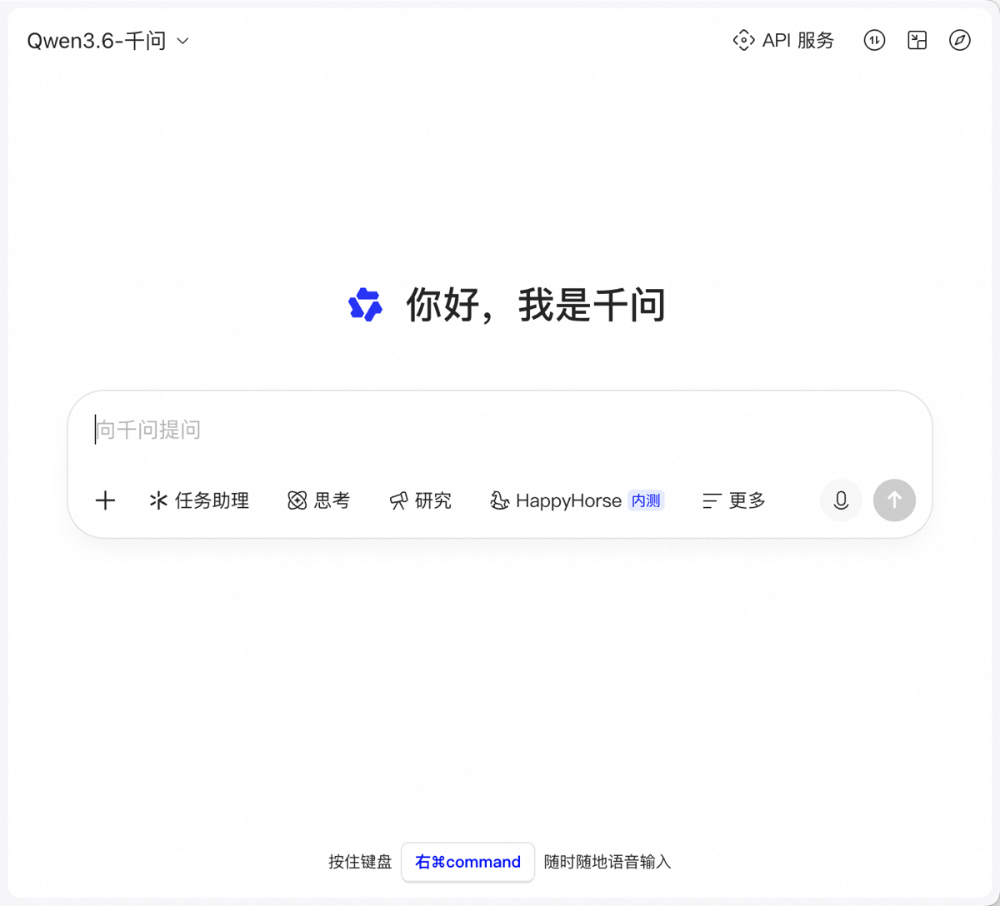
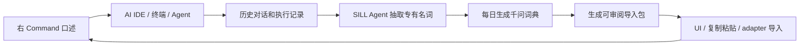
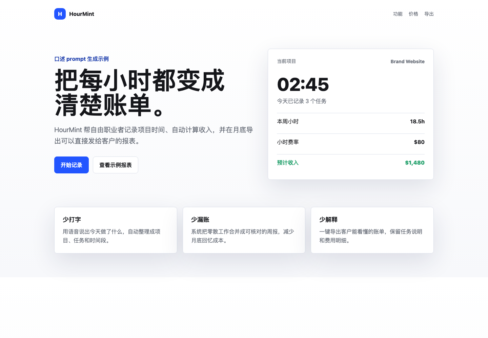
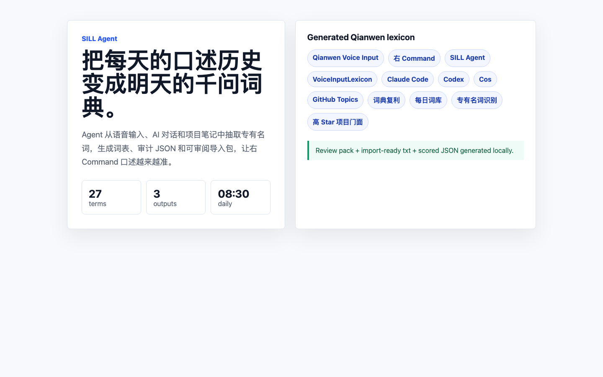

<div align="center">

# 口喷式 Web Coding 的教学

**按住右 Command，把话直接喷进 Codex / Cos / Claude Code / 任意 AI IDE 或终端，让 AI 去执行。**

No typing. Hold right Command, speak to Qianwen voice input, and drive your AI coding agent by conversation.

[](AWESOME.md)


[15 分钟跑通](#15-分钟跑通) · [安装千问语音](docs/zh/INSTALL_QIANWEN_MAC.md) · [口喷工作流](docs/zh/VOICE_TO_WEB_WORKFLOW.md) · [SILL Agent](docs/zh/LEXICON_AGENT.md) · [Awesome 资源](AWESOME.md) · [English](#english)



</div>

## 这是什么

这是一个面向初学者、独立开发者和产品人的 **口喷式 Web Coding 教程**。这里的“口喷式”不是“写提示词写得很嗨”，而是：**按住右 `Command` 调用千问语音输入，把你想让 AI 做的事直接说进对话框、IDE、终端或 Agent 窗口里，让 AI 执行。**

你不需要打字。你只需要对话。Codex、Cos、Claude Code、Cursor、VS Code、ChatGPT 网页、终端里的 AI CLI，本质上都变成了“可被语音驱动的执行器”。

> 右 Command 唤起千问语音 -> 对 AI 说任务 -> AI 执行 -> 你继续口述验收和修改 -> 完成一个真实结果。

## 核心卖点

| 卖点 | 为什么重要 |
| --- | --- |
| 不打字，只对话 | 打字慢、累，还会把注意力拉到拼写和格式；口述能在想法最热的时候直接输出。 |
| 右 Command 全局输入 | 千问语音能把任何输入框变成语音入口，AI IDE、网页对话框、终端都能被口述驱动。 |
| Agent 真执行 | 不是让 AI “给建议”，而是让 Codex / Claude Code / Cos / Cursor 读文件、改文件、跑检查、截图、提交。 |
| 词典复利 | 每天把专有名词、项目名、工具名沉淀进千问词典，第二天识别更准。 |
| 类 Scale 的可复用资产 | 你的语音历史会沉淀成术语库、任务模板和验收标准，越用越像自己的执行系统。 |

## 词典飞轮

千问语音的准确率很高，但真正让“口喷式”稳定的是词典。专有名词一旦识别错，后面的 Agent 执行就可能全部跑偏；词典把这些名词提前喂给语音输入层，让口述更接近真实思考。



本仓库已经包含一个可运行的 SILL Agent 原型：

```bash
node agent/lexicon-agent.mjs \
  --input data/sample-voice-history.md \
  --base lexicons/qianwen/base-terms.txt \
  --daily \
  --max 300
node agent/qianwen-lexicon-import.mjs --copy --open-qianwen
```

更多见 [SILL Agent 中文说明](docs/zh/LEXICON_AGENT.md) / [English SILL Agent guide](docs/en/LEXICON_AGENT.md)。

## 为什么、问题、解决方案

| 问题 | 为什么会发生 | 解决方案 |
| --- | --- | --- |
| 打字干扰思考 | 人在敲字时会处理拼写、缩写、格式、标点，思路被手速拖慢 | 用右 Command 语音输入，把想法直接说进 AI 执行器 |
| 语音会错专有名词 | 项目名、英文工具、缩写、内部术语不在默认识别上下文里 | 用千问语音词典/热词库沉淀专有名词 |
| 词典手工维护很累 | 每天都会出现新项目、新工具、新人名、新缩写 | SILL Agent 每天从历史对话自动生成词表 |
| Agent 会听错任务边界 | 口述任务太长时容易混入口头禅和无关信息 | 用“目标、边界、验收”三段式口述模板 |
| 开源项目不容易吸 star | 只有教程不够，必须有可运行工具和可复用资产 | README + 截图 + Agent 原型 + Awesome + Roadmap 一起做 |

## 15 分钟跑通

| 分钟 | 你做什么 | 目标 |
| --- | --- | --- |
| 0-3 | 打开 [千问语音安装教程](docs/zh/INSTALL_QIANWEN_MAC.md)，下载安装 QianwenMac | 让 macOS 可以随时语音输入 |
| 3-5 | 打开 Codex、Cos、Claude Code、Cursor 或任意 AI IDE / 终端 | 准备一个 AI 可以执行任务的对话框 |
| 5-8 | 按住右 `Command`，直接说任务 | 不打字，把任务喷进 AI 输入框 |
| 8-12 | 让 AI 读取上下文、创建文件、运行检查或修改代码 | AI 真正开始干活 |
| 12-15 | 继续口述验收：“打开预览、截图、修移动端、提交到 GitHub” | 用对话完成闭环 |

第一条可以直接这样说进 Codex / Claude Code / AI IDE：

```text
帮我在当前目录做一个单页网页 demo。
主题是给自由职业者用的时间记录工具。
你先创建文件，再运行本地预览或告诉我怎么打开。
完成后检查手机端有没有溢出，并把结果截图放进 assets/screenshots。
```

## 实机截图

| 步骤 | 截图 |
| --- | --- |
| 官方下载页 |  |
| DMG 安装窗口 |  |
| 千问语音输入入口 |  |
| 口述生成的网页示例 |  |
| SILL Agent 词典生成 |  |

## 学习路径

| 阶段 | 你会做出什么 | 学到什么 | 预计时间 |
| --- | --- | --- | --- |
| 0. 装好语音入口 | 任意输入框都能语音输入 | 右 Command、权限、输入框焦点 | 15 min |
| 1. 对 AI 下任务 | AI 创建或修改一个网页 | 说清目标、目录、验收标准 | 30 min |
| 2. 口述迭代 | AI 按你的话修 UI / bug / 文档 | 小步指令、检查项、截图验收 | 1 h |
| 3. 让 AI 自查 | 自动运行预览、检查、Git 状态 | 把“执行”和“验收”都说出来 | 1 h |
| 4. 发布交付 | GitHub README、截图、推送 | 用口述完成开源项目门面 | 30 min |
| 5. 词典复利 | 每日千问词典 | 从历史对话抽取术语，生成可审阅导入包，再导入语音词典 | 10 min/day |

## 口喷工作流

1. 光标放进 AI 对话框、IDE 输入框或终端。
2. 按住右 `Command`，直接说任务：`在当前目录创建一个网页 demo，并自己检查能不能打开。`
3. 让 AI 先定计划：`先说你准备改哪些文件，再开始执行。`
4. 让 AI 真干活：`现在创建文件、运行检查、截图验证。`
5. 继续口述验收：`移动端有没有溢出？README 有没有截图？Git 状态干净吗？`
6. 继续口述修复：`只修 hero 区域，不要动其它模块。`
7. 口述交付：`提交 commit，推送 GitHub，告诉我最终链接。`

完整方法见 [中文工作流](docs/zh/VOICE_TO_WEB_WORKFLOW.md) / [English workflow](docs/en/VOICE_TO_WEB_WORKFLOW.md)。

## SILL Agent：每日生成千问词典

SILL 是 **Speech Intent Lexicon Loop**。它把你的语音历史、AI 对话、项目笔记变成词典：

```bash
node agent/lexicon-agent.mjs --input data/sample-voice-history.md --base lexicons/qianwen/base-terms.txt --out lexicons/qianwen/generated-lexicon.txt --json lexicons/qianwen/generated-lexicon.json
scripts/run-daily-lexicon.sh data
node agent/qianwen-lexicon-import.mjs --lexicon lexicons/qianwen/daily/2026-05-31.txt --copy --open-qianwen
```

当前原型会生成：

- `lexicons/qianwen/generated-lexicon.txt`
- `lexicons/qianwen/generated-lexicon.json`
- `lexicons/qianwen/daily/2026-05-31.txt`
- `lexicons/qianwen/daily/2026-05-31.json`
- `lexicons/qianwen/import/latest-import-pack.md`
- `lexicons/qianwen/import/latest-import-pack.json`

`txt` 用来导入或复制到千问语音词典，`json` 保留词条分数、来源和生成时间。`qianwen-lexicon-import` 会生成可审阅导入包，也可以把词条复制到剪贴板并打开千问。已安装的 Qianwen app 内部可见 `VoiceInputLexicon` 能力，项目会把导入层做成可替换 adapter，避免把内部接口当成永久公开 API。

## Prompt Recipes

| 场景 | 直接开口这样说 |
| --- | --- |
| 让 AI 开始 | `你在当前目录直接执行，先看文件，再给我一个简短计划。` |
| 生成网页 | `创建一个可运行的单页网页，完成后用浏览器截图验证。` |
| 修移动端 | `检查 390px 宽度下有没有拥挤、溢出、按钮过小，并直接修。` |
| 修视觉 | `不要只改颜色，重新调整字号、间距、卡片密度和主按钮状态。` |
| 查问题 | `先列出可能的问题，再按最高影响修复。` |
| 管 Git | `查看 git status，提交本次改动，commit 信息要简短。` |
| 推 GitHub | `创建公开仓库并推送，最后验证远端链接能打开。` |

## Awesome 资源

精选资源在 [AWESOME.md](AWESOME.md)。这个列表只收“能帮你更快说清楚、做出来、改稳定”的资源，每条都有推荐理由，不做链接垃圾场。

## Global / Multilingual Usage

口喷式不只适合中文。词典可以同时维护中文、English、日本語、한국어、产品名、公司名、项目名、API 名称和团队内部缩写。推荐把跨语言术语统一放进 `lexicons/qianwen/base-terms.txt`，例如 `Qianwen Voice Input`、`右 Command`、`Claude Code`、`GitHub Topics`、`VoiceInputLexicon`。

## 信任检查

本教程使用的千问语音安装包在 2026-05-30 重新验证：

- 下载入口：`https://download.qianwen.com/download/qianwenmac?platform=mac&ch=pcqwen@default`
- 跳转文件：`QianwenMac_V3.4.0.75_mac_pf3000_(zh-cn)_releasemini_(Build2900379).dmg`
- SHA-256：`e8e83f3a521ecc9b7456e1204fd72825405f6fdeda50bad82c032fe1c2df2152`
- Apple Gatekeeper：`accepted`
- 签名来源：`Developer ID Application: Shanghai Zhixin Puhui Technology Co., Ltd. (8T9NQJXDU3)`

## 参与贡献

欢迎提交新课程、新 prompt、新截图、新工具和失效链接修复。先看 [CONTRIBUTING.md](CONTRIBUTING.md)。一句话原则：**必须可复现、可截图、可解释为什么值得推荐。**

## English

## What This Is

This is a bilingual, screenshot-backed guide to **mouth-driven web coding**. “Mouth-driven” means: hold right `Command`, invoke Qianwen voice input, speak directly into Codex, Cos, Claude Code, Cursor, an AI IDE, or an AI terminal, and let the agent execute the task.

It is not about typing better prompts. It is about not typing at all:

> Hold right Command -> speak the task -> the AI executes -> you keep speaking checks and fixes -> the work ships.

## Core Pitch

| Selling point | Why it matters |
| --- | --- |
| No typing, only conversation | Typing is slow and tiring; it also pulls attention into spelling, casing, and formatting. |
| Global right Command input | Qianwen voice input turns any focused text box into a speech entry point. |
| Real agent execution | Codex, Claude Code, Cos, Cursor, terminals, and AI IDEs can read files, edit files, run checks, capture screenshots, and commit. |
| Lexicon compounding | Every day’s proper nouns become tomorrow’s better recognition. |
| Scale-like reusable asset | Your spoken history becomes a reusable vocabulary, task pattern, and acceptance-standard dataset. |

## Lexicon Flywheel

Qianwen recognition is strong, but the flywheel is the lexicon. If proper nouns are wrong, the agent can execute the wrong task. The lexicon moves your domain vocabulary into the speech layer before the agent sees the task.

```bash
node agent/lexicon-agent.mjs --input data/sample-voice-history.md --base lexicons/qianwen/base-terms.txt --out lexicons/qianwen/generated-lexicon.txt --json lexicons/qianwen/generated-lexicon.json
scripts/run-daily-lexicon.sh data
node agent/qianwen-lexicon-import.mjs --copy --open-qianwen
```

Read the full guide: [SILL Agent](docs/en/LEXICON_AGENT.md).

## Why / Problems / Solutions

| Problem | Why it happens | Solution |
| --- | --- | --- |
| Typing interrupts thinking | You manage spelling, punctuation, and formatting while thinking | Hold right Command and speak directly into the AI executor |
| Speech misses proper nouns | Project names, tools, acronyms, and internal terms are out of context | Maintain a Qianwen voice lexicon |
| Manual lexicon work is annoying | New terms appear every day | Let SILL Agent generate a daily lexicon from historical conversations |
| Agent scope drifts | Spoken tasks can include filler words | Use the goal / boundary / acceptance template |
| Tutorial repos rarely get stars | A tutorial alone is not enough | Combine README, screenshots, runnable agent, Awesome list, and roadmap |

## 15-Minute Quick Start

| Minute | Action | Goal |
| --- | --- | --- |
| 0-3 | Follow the [Qianwen macOS install guide](docs/en/INSTALL_QIANWEN_MAC.md) | Enable system-wide voice input |
| 3-5 | Open Codex, Cos, Claude Code, Cursor, or any AI IDE / terminal | Prepare an agent that can execute |
| 5-8 | Hold right `Command` and speak the task | Put the task into the AI input without typing |
| 8-12 | Ask the AI to create files, run checks, or modify code | Make the AI do the work |
| 12-15 | Speak acceptance checks like “preview it, screenshot it, fix mobile, push to GitHub” | Complete the loop by voice |

Try this first prompt:

```text
In the current folder, build a one-page website demo for a time-tracking tool for freelancers.
Create the files yourself, preview it or tell me exactly how to open it,
check the mobile layout, save a screenshot, and summarize what changed.
```

## Learning Path

| Stage | Output | You Learn | Time |
| --- | --- | --- | --- |
| 0. Enable voice input | Any text box accepts speech | Right Command, permissions, focus | 15 min |
| 1. Speak a task | AI creates or edits a web page | Goal, directory, acceptance criteria | 30 min |
| 2. Iterate by voice | AI fixes UI, bugs, and docs | Small instructions, checks, screenshots | 1 h |
| 3. Ask the AI to verify | Preview, checks, Git status | Execution plus acceptance by voice | 1 h |
| 4. Ship | GitHub README, screenshots, push | Open-source polish by conversation | 30 min |
| 5. Compound the lexicon | Daily Qianwen lexicon | Extract terms, prepare an import pack, then review and import | 10 min/day |

## Why Star This Repo

- It is practical: every step aims at getting an AI agent to actually do work.
- It is bilingual: Chinese-first, English-complete.
- It is screenshot-backed: no vague “just install it” hand waving.
- It is curated: the Awesome list explains why each resource matters.
- It is contributor-friendly: lesson and resource formats are defined.

## References

This repo borrows the README discipline of high-star projects such as [sindresorhus/awesome](https://github.com/sindresorhus/awesome), [build-your-own-x](https://github.com/codecrafters-io/build-your-own-x), [public-apis](https://github.com/public-apis/public-apis), [free-programming-books](https://github.com/EbookFoundation/free-programming-books), [Web-Dev-For-Beginners](https://github.com/microsoft/Web-Dev-For-Beginners), and [shadcn/ui](https://github.com/shadcn-ui/ui).
