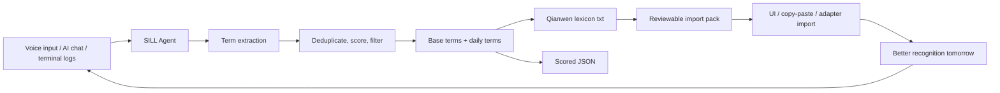

# SILL Agent: Turn Spoken History into a Qianwen Lexicon

SILL means **Speech Intent Lexicon Loop**. It reads your voice input, AI conversations, project notes, and terminal logs, extracts domain terms, generates a reusable lexicon, and prepares a reviewable Qianwen import pack.

The goal is not merely better recognition today. The goal is a system that understands your vocabulary better every day.

## Why a Lexicon Matters

Typing is slow and tiring. More importantly, typing interrupts thought. While you are typing, attention leaks into spelling, casing, punctuation, product names, and tool names.

Speaking is closer to the speed of thought. You say the idea while it is alive, and the AI agent executes. But for that loop to work, one thing must be reliable: **proper nouns must not be misrecognized**.

Examples:

- `Codex`
- `Claude Code`
- `Cos`
- `Qianwen Voice Input`
- `right Command`
- `VoiceInputLexicon`
- `SILL Agent`
- `Scale AI`
- `GitHub Topics`

A lexicon tells the speech system about these words before you need them.

## Evidence of Qianwen Lexicon Capability

The installed Qianwen app exposes voice-input lexicon capability internally:

```text
getAiVoiceInputLexiconConfig
getAiVoiceInputLexicon
addAiVoiceInputLexiconWords
deleteAiVoiceInputLexiconWords
onAiVoiceInputLexiconChange
```

This project uses a layered strategy:

- Stable layer: generate newline-separated lexicon txt, scored JSON metadata, and a review pack.
- Operation layer: import terms through Qianwen UI, copy-paste, or any available import route.
- Experimental layer: wrap an internal adapter later, without treating private APIs as a stable public contract.

## Architecture



## Run It

```bash
node agent/lexicon-agent.mjs \
  --input data/sample-voice-history.md \
  --base lexicons/qianwen/base-terms.txt \
  --daily \
  --max 300
node agent/qianwen-lexicon-import.mjs --copy --open-qianwen
```

Outputs:

```text
lexicons/qianwen/daily/2026-05-31.txt
lexicons/qianwen/daily/2026-05-31.json
```

The `txt` file is import-ready for Qianwen lexicon or copy-paste workflows. The `json` file keeps scores, sources, and generation time for review.

To include the import handoff in the loop:

```bash
node agent/qianwen-lexicon-import.mjs --lexicon lexicons/qianwen/daily/2026-05-31.txt --copy --open-qianwen
```

It writes `lexicons/qianwen/import/latest-import-pack.*`, copies terms to the clipboard, and opens Qianwen. By default it does not call Qianwen private APIs; full automatic import belongs in a replaceable adapter layer.

## Daily Automation

This repo includes a launchd template:

```text
automation/com.awesome-mouth-driven-web-coding.lexicon.plist
```

Before using it, replace `/ABSOLUTE/PATH/TO/awesome-mouth-driven-web-coding` with your repo path, then:

```bash
cp automation/com.awesome-mouth-driven-web-coding.lexicon.plist ~/Library/LaunchAgents/
launchctl load ~/Library/LaunchAgents/com.awesome-mouth-driven-web-coding.lexicon.plist
```

It generates a new lexicon and reviewable import pack every day at 08:30.

## Problems and Solutions

| Problem | Why it happens | Solution |
| --- | --- | --- |
| Too much noise | Spoken history contains filler words and generic terms | Keep core terms in `base-terms.txt` and filter by score |
| Lexicon bloat | Daily extraction keeps adding terms | Use `--max` and keep only high-value terms |
| Wrong terms get reinforced | Misrecognitions can enter the lexicon | Review the JSON with source evidence before import |
| Qianwen import route changes | Internal lexicon APIs are not public contracts | Keep txt/json stable and make the adapter replaceable |
| Privacy risk | History may contain company, customer, or personal names | Run locally by default and review before import |

## High-Star Selling Points

- Not another prompt list: a compounding system for voice-driven AI execution.
- Use it daily; improve the next day’s recognition.
- Turn proper-noun recognition into an operational asset.
- Works with any AI executor: Codex, Cos, Claude Code, Cursor, terminals, and browser chats.
