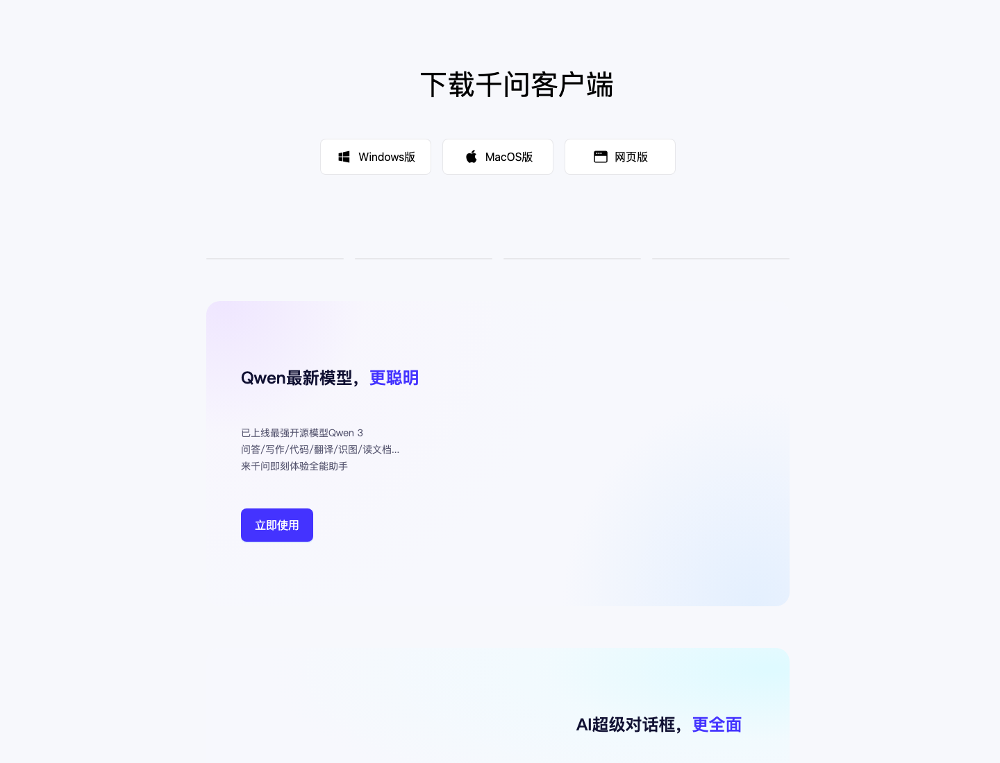
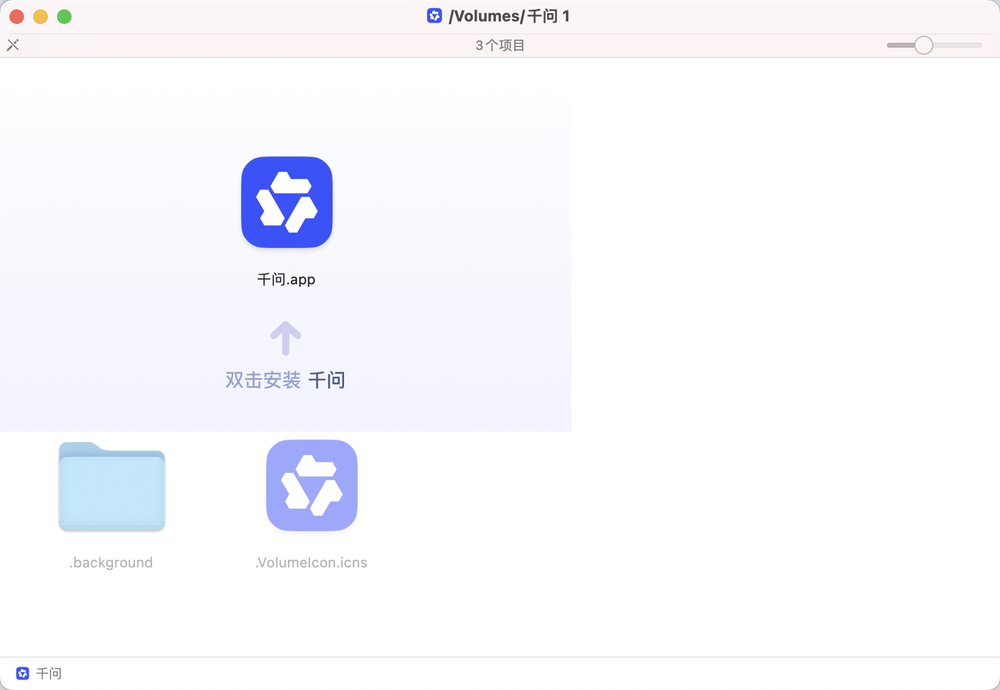
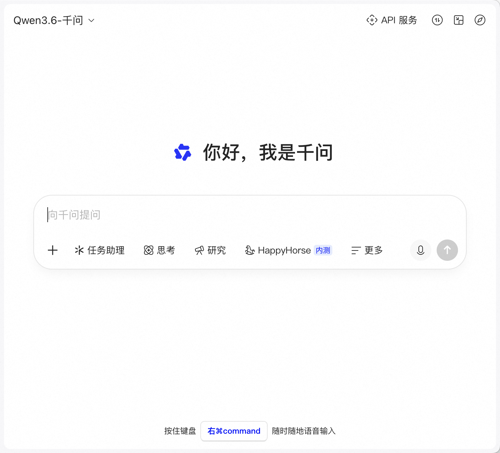

# macOS 安装千问语音输入

本页是“口喷式 Web Coding”的第一步：让你可以在 Codex、Cos、Claude Code、Cursor、VS Code、浏览器、终端或任何输入框里用语音输入任务。核心不是写 prompt，而是按住右 `Command`，把任务直接说给 AI 执行。

## 你需要准备

- 一台 macOS 电脑。
- 网络连接。
- 一个可以接收文字并让 AI 执行任务的工具，比如 Codex、Cos、Claude Code、Cursor、VS Code、ChatGPT 网页、AI CLI 或本地终端。
- 麦克风权限。如果你第一次使用语音输入，macOS 会弹出授权提示。

## 1. 打开下载入口

优先使用这个入口：

```text
https://download.qianwen.com/download/qianwenmac?platform=mac&ch=pcqwen@default
```

如果直接下载打不开，可以先打开官方站点：

- 千问官网：https://www.qianwen.com/
- 千问下载页：https://www.qianwen.com/download



## 2. 下载并验证 DMG

本教程实测下载到的文件名为：

```text
QianwenMac_V3.4.0.75_mac_pf3000_(zh-cn)_releasemini_(Build2900379).dmg
```

可选的命令行验证：

```bash
shasum -a 256 QianwenMac.dmg
hdiutil verify QianwenMac.dmg
```

实测 SHA-256：

```text
e8e83f3a521ecc9b7456e1204fd72825405f6fdeda50bad82c032fe1c2df2152
```

看到 `checksum ... is VALID` 就说明 DMG 校验通过。

## 3. 打开 DMG

双击 DMG 后会出现安装窗口。实测窗口里是 `千问.app`，提示“双击安装 千问”。



## 4. 启动安装

双击 `千问.app`。如果 macOS 提示这是从互联网下载的应用，确认来源是你刚刚下载的官方 DMG 后再继续。

本教程实测的签名信息：

```text
Gatekeeper: accepted
Origin: Developer ID Application: Shanghai Zhixin Puhui Technology Co., Ltd. (8T9NQJXDU3)
```

可选验证命令：

```bash
spctl -a -vv "/Volumes/千问/Qianwen.app"
codesign -dv --verbose=4 "/Volumes/千问/Qianwen.app"
```

## 5. 授权麦克风和输入

首次启动后，千问可能需要麦克风权限。按 macOS 提示进入：

```text
系统设置 -> 隐私与安全性 -> 麦克风
```

允许千问使用麦克风。如果系统还提示辅助功能或输入监控权限，也在同一页授权。

## 6. 开始语音输入

安装完成后，打开任意输入框。实测千问界面底部提示：

```text
按住键盘 右 Command 随时随地语音输入
```



现在你可以在 AI 编程工具或终端里按住右 `Command`，直接说：

```text
你在当前目录直接执行。
先看文件结构，然后创建一个单页网页 demo。
完成后截图检查手机端有没有溢出。
最后告诉我你改了哪些文件。
```

## 7. 准备词典

口喷式使用越多，越应该维护千问语音词典。先把常用专有名词写进：

```text
lexicons/qianwen/base-terms.txt
```

然后运行：

```bash
node agent/lexicon-agent.mjs --input data/sample-voice-history.md --base lexicons/qianwen/base-terms.txt --out lexicons/qianwen/generated-lexicon.txt --json lexicons/qianwen/generated-lexicon.json
node agent/qianwen-lexicon-import.mjs --lexicon lexicons/qianwen/generated-lexicon.txt --copy --open-qianwen
```

把生成的 `generated-lexicon.txt` 导入或复制到千问语音的词典/热词入口。导入适配器会生成可审阅导入包，并可把词条复制到剪贴板。更完整的每日自动化见 [SILL Agent](LEXICON_AGENT.md)。

## 常见问题

**没有听写文字出现怎么办？**

先确认输入框里有光标，再确认麦克风权限已经打开。然后重新按住右 `Command` 说话。

**快捷键冲突怎么办？**

检查其他输入法、窗口管理工具或键盘改键工具是否占用了右 `Command`。

**官网和语音输入 DMG 是不是同一个东西？**

千问官网提供 PC 客户端入口；本教程主线使用的是 QianwenMac 语音输入安装链路。两者都属于千问生态，但本教程只围绕“把语音输入到编程工具”这个目标展开。
