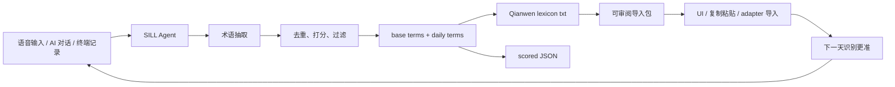

# SILL Agent：把口述历史沉淀成千问词典

SILL 是 **Speech Intent Lexicon Loop**：每天从你的语音输入、AI 对话、项目笔记和终端记录里抽取专有名词，生成可复用词典，并产出可审阅的千问导入包。

它解决的问题不是“今天识别准一点”，而是让你的口述系统越来越懂你。

## 为什么要做词典

打字慢，而且会打断思考。你一边想一边敲字时，注意力会被拼写、大小写、标点、工具名和专有名词拉走。

口述更接近真实思维速度。你想到什么就说出来，AI Agent 负责执行。但口述要稳定工作，必须解决一个问题：**专有名词不能识别错。**

例如这些词如果识别错，Agent 就可能走偏：

- `Codex`
- `Claude Code`
- `Cos`
- `Qianwen Voice Input`
- `右 Command`
- `VoiceInputLexicon`
- `SILL Agent`
- `Scale AI`
- `GitHub Topics`

词典的作用就是把这些词提前告诉语音输入系统，让“口喷式执行”更像和熟悉你业务的人对话。

## 千问词典能力证据

本机安装的 Qianwen app 内部暴露了语音输入词典相关能力：

```text
getAiVoiceInputLexiconConfig
getAiVoiceInputLexicon
addAiVoiceInputLexiconWords
deleteAiVoiceInputLexiconWords
onAiVoiceInputLexiconChange
```

这说明千问语音输入存在 lexicon / hotword 层。当前项目采用分层策略：

- 稳定层：生成可导入的 newline 词表、JSON 元数据和 review pack。
- 操作层：通过千问 UI、复制粘贴或可用导入入口添加词条。
- 实验层：未来再封装内部 lexicon adapter，不把不稳定内部接口当成公开 API 承诺。

## 架构



## 运行

```bash
node agent/lexicon-agent.mjs \
  --input data/sample-voice-history.md \
  --base lexicons/qianwen/base-terms.txt \
  --daily \
  --max 300
node agent/qianwen-lexicon-import.mjs --copy --open-qianwen
```

输出示例：

```text
lexicons/qianwen/daily/2026-05-31.txt
lexicons/qianwen/daily/2026-05-31.json
```

`txt` 是给千问词典导入或复制粘贴用的词表。`json` 保留分数、来源和生成时间，方便审计。

如果你想把导入动作也纳入流程，可以运行：

```bash
node agent/qianwen-lexicon-import.mjs --lexicon lexicons/qianwen/daily/2026-05-31.txt --copy --open-qianwen
```

它会生成 `lexicons/qianwen/import/latest-import-pack.*`，并把词条复制到剪贴板、打开千问。当前默认不调用千问私有 API；真正全自动导入应落在可替换 adapter 层。

## 每日自动化

本仓库提供 launchd 模板：

```text
automation/com.awesome-mouth-driven-web-coding.lexicon.plist
```

使用前把里面的 `/ABSOLUTE/PATH/TO/awesome-mouth-driven-web-coding` 改成你的仓库绝对路径，然后：

```bash
cp automation/com.awesome-mouth-driven-web-coding.lexicon.plist ~/Library/LaunchAgents/
launchctl load ~/Library/LaunchAgents/com.awesome-mouth-driven-web-coding.lexicon.plist
```

它会每天 08:30 生成当天词典和可审阅导入包。

## 这样做会有什么问题

| 问题 | 为什么会发生 | 解决方法 |
| --- | --- | --- |
| 噪声词太多 | 语音历史里有口头禅、停顿和泛词 | 使用 `base-terms.txt` 固定核心词，并用分数过滤 |
| 词典越来越大 | 每天都加入新词会膨胀 | 设置 `--max`，只保留高频和高价值词 |
| 误识别被固化 | 错词也可能进入词典 | JSON 保留来源，导入前可人工审阅 |
| 千问导入接口变化 | 内部 lexicon API 不是公开契约 | 生成标准 txt/json，导入适配层可替换 |
| 隐私风险 | 历史对话可能包含公司、人名、客户信息 | 默认本地运行，不上传；导入前审阅输出 |

## 高 Star 卖点

- 它不是又一个 prompt 列表，而是一个让语音输入持续变准的复利系统。
- 每天使用，每天沉淀，第二天识别更懂你的项目。
- 词典把“专有名词识别”从偶然准确变成可运营资产。
- 适合所有 AI 执行器：Codex、Cos、Claude Code、Cursor、终端和网页对话框。
